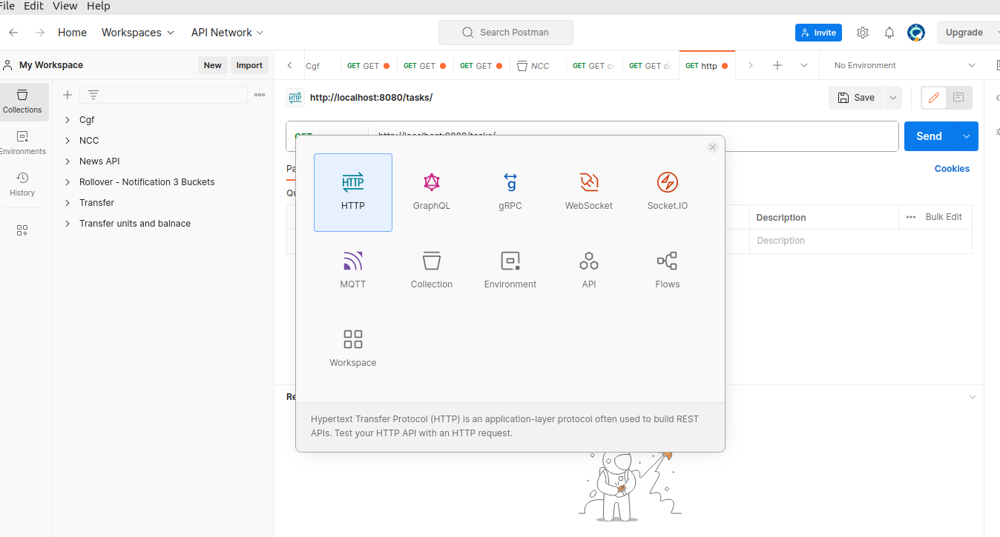

# REST API examples - CODED:
# Pre-requisites:
    - JAVA 8 
    - Git bash (if you are on Windows). You can download it from here: https://git-scm.com/downloads
    - IDE (Intiliji, Eclipse, VS Code, etc)
    - Postman (You can download the desktop version from here: https://www.postman.com/downloads/

# To pull this code into your local machine: 
1. **Install Git:**
   Make sure Git bash is installed on your computer. 
2. **Create a GitHub Account:**
   If you don't have a GitHub account, sign up at [https://github.com/](https://github.com/).
3. **Fork the Repository:**
    - Click on the "Fork" button in the top-right corner of this repository page. This creates a personal copy (fork) of the repository on your GitHub account.
4. **Clone the Repository:**
    - On your forked repository page, click the "Code" button. Copy the repository URL (something like `https://github.com/your-username/repository.git`).
    - Open a terminal of git bash on your local machine.
    - Navigate to the directory where you want to store the code.
    - Run the following command to clone the repository to your local machine:
      ```bash
      git clone https://github.com/your-username/repository.git
      ```

3. **Configure Upstream (Optional):**
    - If you want to keep your fork in sync with the original repository, you can set up an upstream remote.
      ```bash
      cd repository
      git remote add upstream https://github.com/original-username/repository.git
      ```

4. **Pull Changes:**
    - Before making changes, it's a good idea to ensure your fork is up to date.
      ```bash
      git pull origin main
      ```
      If you set up an upstream remote, you can also update your fork from the original repository:
      ```bash
      git pull upstream main
      ```

Certainly! Below is a more descriptive guide for verifying and testing the correctness of the APIs:

## Verifying and Testing APIs

To ensure the correctness of the APIs, follow these steps:

### 1. Run the Application Locally

Execute the following command to start the application:

```bash
./gradlew bootRun
```

This command uses Gradle Wrapper (`./gradlew`) to run the Spring Boot application.

### 2. Use Postman for Testing

Postman is a popular tool for testing APIs. 
### 3. Create a New Request

Open Postman and create a new request:

- Click on "New" in the upper-left corner.
- choose the http type
- Choose the request type (e.g., GET, POST, PUT, DELETE)/ [As shown in the following screenshots]

  
  

  
### 4. Add JSON Data (if applicable)

If your request requires data in the request body (e.g., for POST or PUT requests), follow these steps:

- Click on the "Body" tab in Postman.
- Select the "raw" option.
- Choose "JSON (application/json)" from the dropdown.
- Enter the JSON data corresponding to your request.

  Example JSON data (This varies according to your schema):
    ```json
    {
        "key": "value",
        "another_key": "another_value"
    }
    ```

### 6. Send the Request

After configuring the request details:

- Click the "Send" button to execute the request.

### 7. Review the Response

Examine the response received from the API:

- Check the status code to ensure it matches the expected result.
- Review the response body for the data returned by the API.


# To submit your task:
1. **Make Changes:**
    - Make the necessary changes to the code using your preferred code editor.
2.  **Commit Changes:**
    - After making changes, you need to commit them locally:
      ```bash
      git add .
      git commit -m "Description of the changes"
      ```
7. **Push Changes:**
    - Push your changes to your fork on GitHub:
      ```bash
      git push origin main
      ```
